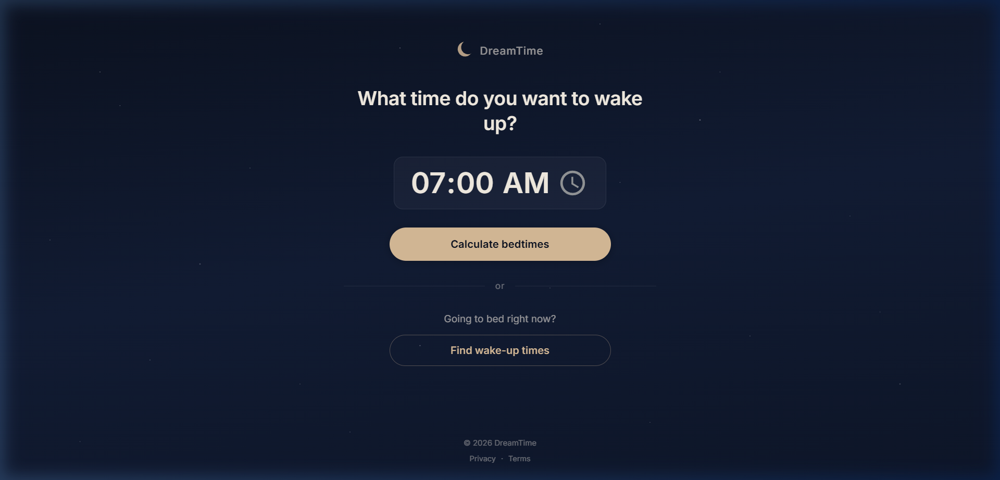
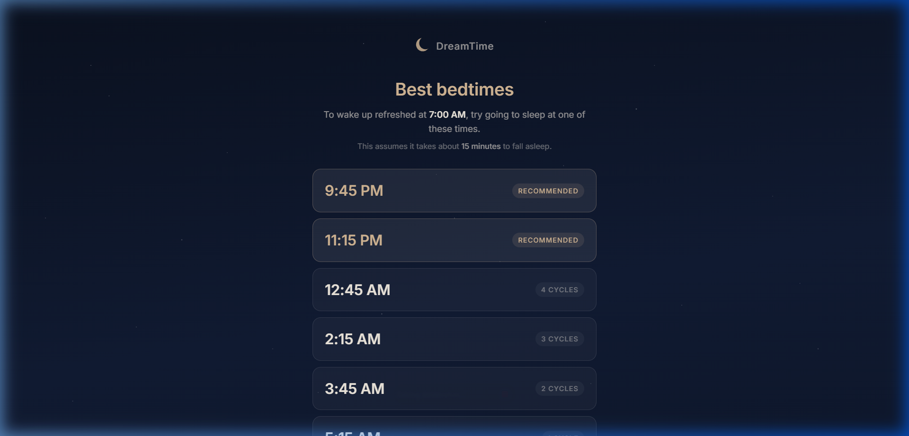
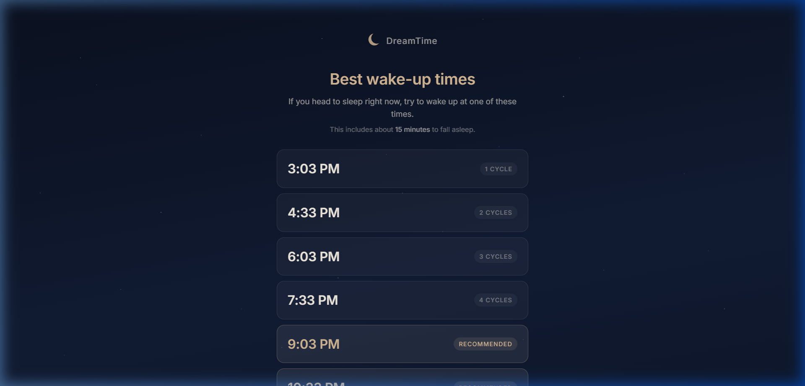

# 🌙 DreamTime — Sleep Cycle Calculator

A minimal, elegant sleep cycle calculator that helps you find the perfect bedtime or wake-up time based on natural 90-minute sleep cycles.



## ✨ Features

- **Calculate Bedtimes** — Pick a wake-up time and get 6 ideal bedtimes
- **Sleep Now Mode** — Instantly calculate the best wake-up times from right now
- **Smart Recommendations** — 5 and 6-cycle options highlighted as optimal choices
- **15-Minute Fall-Asleep Delay** — Built into every calculation for accuracy
- **Zero Dependencies** — Pure HTML, CSS, and JavaScript
- **Fully Accessible** — Keyboard navigation, ARIA labels, screen-reader friendly
- **Respects Reduced Motion** — Animations disabled when users prefer it
- **Mobile-First** — Beautiful on every screen size

## 📸 Screenshots

### Bedtime Results
Enter a wake-up time and get your ideal bedtimes ranked by sleep quality.



### Wake-Up Results
Click "Find wake-up times" to calculate from the current moment.



## 🧠 How It Works

The calculator uses the science of sleep cycles:

1. **Sleep onset delay** — The average person takes ~15 minutes to fall asleep
2. **Sleep cycles** — Each complete cycle lasts ~90 minutes
3. **Optimal rest** — 5 to 6 full cycles (7.5–9 hours) is ideal for most adults
4. **Between-cycle waking** — Waking at the end of a cycle reduces grogginess

### Bedtime Formula

```
bedtime = wake_up_time − 15 min − (cycles × 90 min)
```

### Wake-Up Formula

```
wake_up_time = current_time + 15 min + (cycles × 90 min)
```


```

## 📁 Project Structure

```
├── index.html      # Semantic HTML with SEO meta tags
├── style.css       # Midnight starfield theme, responsive design
├── app.js          # Calculator logic and view state management
├── screenshots/    # README screenshots
│   ├── default-view.png
│   ├── bedtime-results.png
│   └── wakeup-results.png
└── README.md
```

## 🎨 Design

- **Deep midnight blue** gradient background with CSS starfield
- **Warm gold** accent buttons and recommended badges
- **Inter** font family for clean, modern typography
- **Staggered animations** on result cards
- Centered, compact layout (~480px max-width)
- Generous whitespace for a calm, focused experience

## 📄 License

© 2026 DreamTime. All rights reserved.
